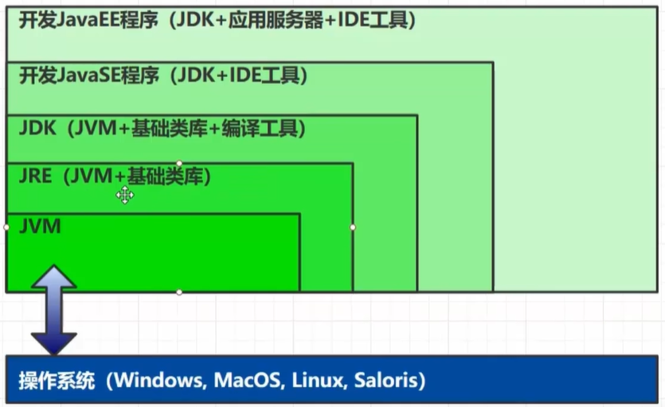
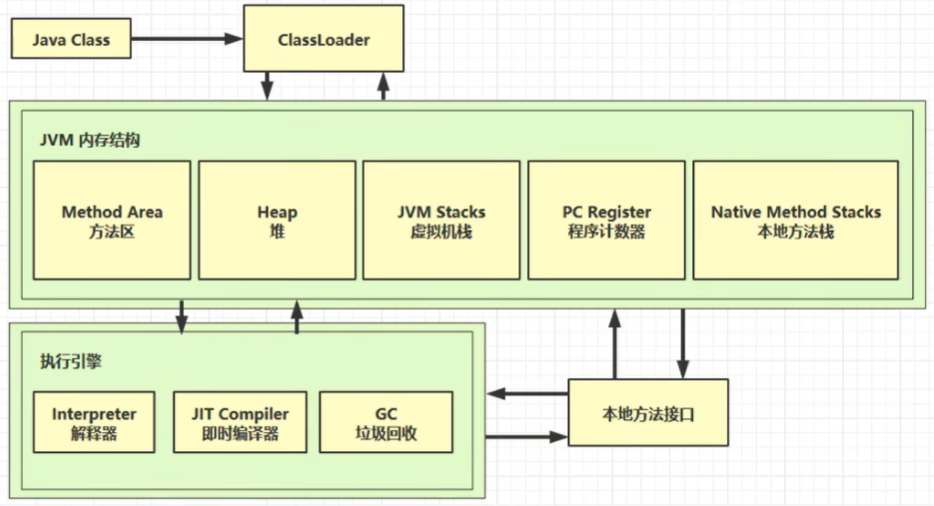
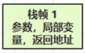
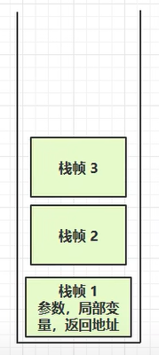

# 1. 基础概念

## 1.1 层级关系

**JVM(Java virtual Machine)**

**JRE(JVM+基础类库)**

**JDK(JVM+基础类库+编译工具)**

**开发JavaSE程序(JDK+IDE工具)**

**开发JavaEE程序(JDK+应用服务器+IDE工具)**

## 1.2 组成部分

# 2. 内存结构

## 2.1 程序计数器

- 采用寄存器结构，可以记住下一条JVM指令==(字节码)==的地址
- 每个线程都有自己==私有==的PC，各管各的
- PC不存在内存溢出问题

## 2.2 栈

线程运行所需要的内存空间，JVM会为每一个线程开辟一个虚拟机栈

**栈帧**：每个**方法**运行时所需要的内存，其中就包括了参数，局部变量，返回地址

方法一调用方法二，方法二调用方法三，栈内情况如图所示

每一个方法调用结束后，栈帧自动出栈，不需要垃圾回收机制来回收
