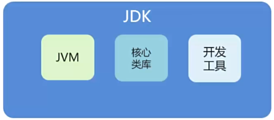
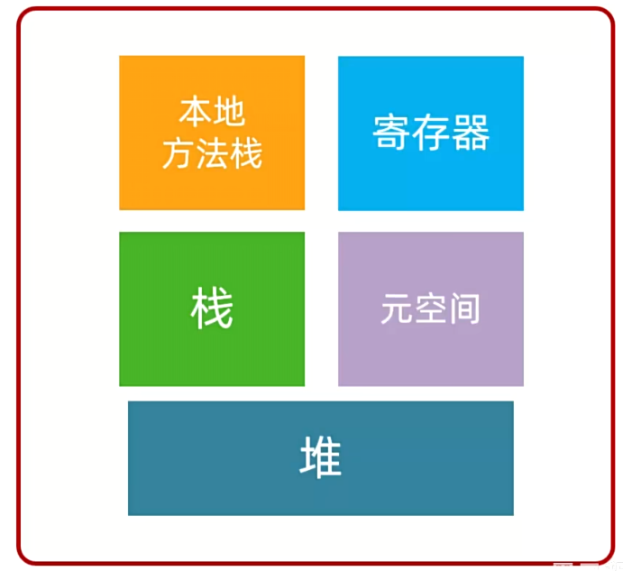

# 〇、

## JDK

JDK(Java Development kit)：Java开发工具包



## JRE

JRE(Java Runtime Environment)：Java运行环境

## IDEA

**项目结构**

project

​	module

​		package

​			class

## Java内存分配



**栈**：

方法运行时进入的内存

存放引用

**堆**：

new来创建的，都存储在堆内存

**方法区**：

字节码文件加载时进入的内存

## JavaBean

JavaBean 是一种遵循特定命名与结构规范的可复用 Java 类。

JavaBean = **一个有字段 + Getter/Setter + 无参构造函数** 

**idea快捷键**：alt+insert


## 包机制

`package`机制的引入解决了类名冲突的问题（不同的文件夹中可能存在相同名字的类）

**一个类总是只属于某个包**，完整类名是`包名.类名`

JVM只看完整类名

### 静态导入包

```java
import static java.lang.Math.random;
public class Test{
    public static void main(String[] args){
        System.out.println(random());
        //达到简略的目的，不用写math.random()
    }
}
```


## 函数式编程

· Lambda表达式只能简化函数式接口的匿名内部类书写

· **函数式接口**：只包含 **一个抽象方法** 的接口

```java
Arrays.sort(arr, new Comparator<Integer>() {
    @Override
    public int compare(Integer a, Integer b) {
        return b - a;
    }
});
```

**lambda写法**

```java
Arrays.sort(arr, (Integer a, Integer b) -> {
        return b - a;
    }
);
```


# 一、Java基础语法

## 基本数据

```java
int i=10;
int i2=010;
int i3=0x10
int i4=10_0000_0000
//i=10 i2=8 i3=16 i4=1000000000前缀0代表8进制，前缀0x代表16进制
```

## 类型转换

```java
//低---------------->高
//byte,short,char->int->long->float->double
```

强制转换 高->低

```java
int a = 77;
byte b = (byte)a;
```

自动转换 低->高

## 变量、常量

```java
public class demo{
    static int a//类变量，方法直接引用
    int b//实例变量，需要将类实例化
    static final int d//常量，方法直接引用
    public static void main(String[] args){
        int c//局部变量
	}
}
```

## 三元运算符

```java
public static void main(String[] args) {
        int a =  2;
        int b = 3;
        System.out.println(a < b ? a : b);
    }
// 2
```


## Switch

```java
public class Switch {
    public static void main(String[] args) {
        char grade='c';
        switch (grade){
            case 'A':
                System.out.println('A');
                break;
            case 'B':
                System.out.println('B');
                break;
            case 'C':
                System.out.println('C');
                break;
            case 'D':
                System.out.println('D');
                break;
            default:
                System.out.println("wrong");
        }
    }
}
//不加break会产生case穿透现象
```

## 增强for循环

```java
public class demo{
    public static void main(String[] args){
        int[] nums={1,2,3,4,5};
        for(int x:nums){
            System.out.println(x);
        }
    }
}
```


## 静态代码块

```java
public class Person{
    {
        System.out.println('匿名代码块');
        //匿名代码块，创建对象实例时自动创建
    }
    
    static{
        System.out.println('静态代码块');
        //静态代码块
        //创建类时创建
    }
    public Person(){
        System.out.println('构造方法');
    }
    public static void main(String[] args){
        Person person1=new Person();
        System.out.println("=========");
        Person person2=new Person();
    }
}
/*
静态代码块
*/
```

## classpath和jar

==classpath==

- 一个环境变量
- 指导JVM如何搜索class
- 数据类型是一个路径集合（；；）JVM依次查找，如果在某路径下找到则停止，若所有路径下都未找到则报错

## 抽象类

```java
public abstract void Action(){
    public abstract dosomething(){}
   	public B(){}
}
```

抽象类无法实例化

抽象类中可以有普通方法

## 接口

只负责定义规范

```java
public interface UserService(){
    //接口中所有定义都默认是public abstract
    //接口简便写直接 返回值类型+方法名
    void add();
    void delete();
    
}
```

```java
public class UserServiceImpl implements UserService{
    public void add(){
        
    }
    public void delete(){
        
    }
}
```

接口不包含实例变量，但可以有static final常量(==并不常用==)

## 正则表达式

慢慢学

# 二、 面向对象

## 类

类是所有实例的==蓝图==

Java类由==变量==和==方法==组成

Java类可以包含以下类型的变量

| 变量类型 | 特点                                                 |
| -------- | ---------------------------------------------------- |
| 局部变量 | 在方法中定义的变量                                   |
| 成员变量 | 定义在类中，创建对象时实例化                         |
| 类变量   | 特殊的成员变量，加载类时被实例化，使用static进行修饰 |

## 方法

`System.out.println()`

`System`是系统类

`out`是一个对象

`println()`是`out`中的一个方法

==方法是程序中最小的执行单元==

### 类方法

类方法属于类，而不属于某个特定的对象

```java
public class Demo01 {
    public static void main(String[] args) {
        int i=add(1,2);
        System.out.println(i);
    }
    //加上static后就是类方法，其他方法可以直接引用
    public static int add(int a,int b){
        return a+b;
    }
}
```

| **特性**          | **静态方法 (`static`)**            | **非静态方法 (实例方法)**                          |
| :---------------- | :--------------------------------- | :------------------------------------------------- |
| **归属对象**      | 属于类本身                         | 属于类的实例（对象）                               |
| **调用方式**      | `类名.方法名()`                    | `对象名.方法名()`                                  |
| **内存时机**      | 类加载时分配内存                   | 对象实例化时分配内存                               |
| **访问成员变量**  | 只能直接访问静态成员，因为没有this | 可访问静态和非静态成员                             |
| **访问方法**      | 只能访问静态方法                   | 全都能访问                                         |
| **`this` 关键字** | 不能使用（无当前对象上下文）       | 可以使用（指向调用的对象），隐藏在在方法参数列表中 |
| **多态性**        | 不支持重写（编译时绑定）           | 支持重写（运行时动态绑定）                         |

### 构造方法

构造方法用于创建类的**实例**

类中如果没有定义任何构造方法，Java也会提供默认的**无参构造函数**

如果自己设计了构造方法，默认的无参构造方法便失效了。

```java
public class Person {
    String name;
    int age;

    public Person(String name, int age) {
        this.name = name;
        this.age = age;
    }
}
```


## 重载与重写

| 区别点   | 重载方法 | 重写方法                                       |
| :------- | :------- | :--------------------------------------------- |
| 参数列表 | 必须修改 | 一定不能修改                                   |
| 返回类型 | 可以修改 | 一定不能修改                                   |
| 异常     | 可以修改 | 可以减少或删除，一定不能抛出新的或者更广的异常 |
| 访问     | 可以修改 | 一定不能做更严格的限制（可以降低限制）         |

**重载（overload）**作用于同一个类或者一个子类之中

一个类里，方法名字**相同**，但参数列表不同，返回值也可能不同

重载要求==必须改变原本方法的参数列表==

```java
public class Demo {
    public static void main(String[] args) {
        func(2);
        func(2.1F);
    }
    public static void func(int a){
        System.out.println("这是一个整型");
    }

    public static void func(float a){
        System.out.println("这是一个浮点型");
    }
}
```

**重写（override）**作用于子类和父类之间

子类定义一个与父类具有相同名称，参数列表，返回类型的方法，但具体实现形式不同，**即外壳不变，核心重写！**

```java
class A{
    public void test(){
        System.out.println("A的非静态方法")
    }
}

public class B extends A{
    public void test(){
        System.out.println("B的非静态方法")
    }
}
```


## 继承

### 继承体系

子类可以通过继承来得到父类的变量和方法

Object万物起源，所有类都直接或间接继承Object(你不写JVM也会给你加上)

```java
class 父类{
}
class 子类 extends 父类{
}
```

```java
public class Student extends Person{
    
}//Student继承了Person类
//Ctrl+H可以打开继承树
//所有类都继承object类
//Java取消了多重继承
```

| 类成分   | 非私有   | private  |
| -------- | -------- | -------- |
| 构造方法 | 不能继承 | 不能继承 |
| 成员变量 | 能       | 能       |
| 成员方法 | 能       | 不能     |

### 构造方法

子类不继承构造方法，但子类的构造方法**需要**对父类的构造方法进行（显式或隐式）地调用

- 父类的构造方法没有参数列表，子类构造方法会自动调用父类方法
- 父类的构造方法有参数列表，子类需要使用`super`关键字调用构造器

```java
public class Demo {
    public static void main(String[] args) {
        B b = new B();
    }
}
class A{
    A(){
        System.out.println('a');
    }
}
class B extends A{
    B(){
        System.out.println('b');
    }
}
```

**继承的特性**

- 子类继承父类的非private属性和方法
- 子类可以自己定义属性
- 子类可以用自己的方式实现父类的方法（override）

## 多态

方法的多态，不同的对象调用**同一方法**，会有**不同**的效果

多态基于以下三个条件而存在：

（1）继承

（2）重写

（3）**父类引用指向子类对象**

Alt+insert: override 在子类中选择父类方法进行重写覆盖

Alt+enter 快速新建对象

**父类的引用可以指向子类的实例**

### 调用规则

**变量调用**：编译看左边，运行看左边

**方法调用**：编译看左边，运行看右边

调用静态方法时，实际方法取决于==引用类型==，静态方法不参与多态，在编译时已经完成绑定
调用非静态方法时，实际方法取决于==实例类型==

### 静态方法（类方法）

```java
class A{
    public static void staticTest(){
        System.out.println("A的静态方法");
    }
}

class B extends A{
    public static void staticTest(){
        System.out.println("B的静态方法");
    }
}

public class Demo{
    public static void main(String[] args) {
            A a=new A();
            A b=new B();
            a.staticTest();
            b.staticTest();
    }
}

/*
A的静态方法
A的静态方法
 */    
```

### 非静态方法

```java
class A{
    public void test(){
        System.out.println("A的非静态方法")
    }
}

public class B extends A{
    public void test(){
        System.out.println("B的非静态方法")
    }
}

public class demo{
    public static void main(){
        A a=new A();
        A b=new B();
        a.test();
        b.test();
    }
}
//如果子类没有重写该方法，会自动调用父类方法
//A的非静态方法
//B的非静态方法
```

## 抽象类

抽象类是特殊的类，不能被用于实例化对象

抽象类必须被**继承**才能使用

抽象类用`abstract`进行修饰

抽象类特点：

（1）不能实例化

（2）可以包含抽象方法

（3）可以包含具体方法

（4）可以包含构造方法

```java
abstract class Animal {
    private String name;
    public Animal(String name) {
        this.name = name;
    }
    // 具体方法
    public void eat() {
        System.out.println(name + " is eating.");
    }
    // 抽象方法
    public abstract void makeSound();
}
```

继承抽象类的子类一定要实现抽象方法

```java
// 具体子类
class Dog extends Animal {
    public Dog(String name) {
        super(name);
    }
    
    @Override
    public void makeSound() {
        System.out.println("Woof woof!");
    }
}
```


## 接口

**类**：包含属性和方法

**接口**：抽象方法的集合

`interface`可以被用于申明接口

接口只能包含final和static变量

```java
[可见度] interface 接口名称 [extends 其他的接口名] {
        // 声明变量
        // 抽象方法
}
```

类(抽象类)使用`implements`关键字实现接口

```java
class ... implements 接口名称[, 其他接口名称, 其他接口名称..., ...] ...
```

接口可以继承接口

```java
// 文件名: Sports.java
public interface Sports
{
   public void setHomeTeam(String name);
   public void setVisitingTeam(String name);
}
 
// 文件名: Football.java
public interface Football extends Sports
{
   public void homeTeamScored(int points);
   public void visitingTeamScored(int points);
   public void endOfQuarter(int quarter);
}
```

## final关键字

| 成分         | 说明                   |
| ------------ | ---------------------- |
| final class  | 最终类，不能继承       |
| final func() | 最终方法，不能重写     |
| final value  | 常量，只能初始化时赋值 |

## 内部类


# 三、Java基础类（java.lang)

## 字符串

### String

String是一个常量，他无法被改变！！！

**1、构造方法**

==直接赋值==

`String name = "123"`

> 直接赋值的方法会用到Stringtable结构，这是一个存在于堆的结构，实现了字符串良好的复用性能

==new方法==

| 构造方法                       | 说明                              |
| ------------------------------ | --------------------------------- |
| public String()                | 创建空白字符串                    |
| public String(String original) | 根据原先的字符串创建字符串        |
| public String(char[] chs)      | 根据字符数组创建字符串            |
| public String(byte[] chs)      | 根据字节数组创建字符串（ASCLL码） |

**2、字符串比较**

| 计算符                     | 比较方法             |
| -------------------------- | -------------------- |
| ==                         | 比较引用值           |
| boolean equals()           | 比较实际值           |
| boolean equalsIgnoreCase() | 忽略大小写比较实际值 |

**3、常用api**

| 方法                                           | 描述                                             |
| ---------------------------------------------- | ------------------------------------------------ |
| char charAt(int index)                         | 返回指定索引处的char值                           |
| String concat(String str)                      | 将str连接到此字符串的末尾                        |
| char[] toCharArray()                           | 将此字符串转换为字符数组                         |
| String substring(int beginIndex, int endIndex) | 返回一个子字符串                                 |
| String replace(char a,char b)                  | 将字符串中的a全部换成b，返回一个新字符串，有重载 |


### StringBuilder

1、常用api

| 方法                           | 描述             |
| ------------------------------ | ---------------- |
| StringBuilder append(任意类型) | 添加任意类型数据 |
| StringBuilder reverse()        | 反转sb中的内容   |


# 四、Java常用类（java.util）

## 时间与日期类

### Date

### SimpleDateFormat

### Calendar

## 工具类

### Arrays

### Random


# 五、集合框架

```
            ┌───────────┐
            │ Collection│  ← 顶层接口（定义集合的基本操作）
            └──────┬────┘
                   │
   ┌───────────────┼────────────────┐
   │               │                │
┌──▼───┐       ┌───▼───┐        ┌───▼───┐
│ List │       │  Set  │        │ Queue │
└──┬───┘       └──┬────┘        └──┬────┘
   │              │                │
   │              │            ┌───▼────────┐
   │              │            │ Deque      │
   │              │            └────────────┘
   │              │
┌──▼──────┐   ┌──▼───────┐
│ ArrayList│  │ HashSet  │
│ LinkedList│ │ TreeSet  │
│ Stack     │ │ LinkedHashSet│
└───────────┘ └──────────────┘


```

## List

==有序，可重复，有索引==

| 方法                        | 描述                           |
| --------------------------- | ------------------------------ |
| boolean add(E  e)           | 添加元素                       |
| int size()                  | 列表长度                       |
| E get(int index)            | 获取index位置元素              |
| E set(int index, E element) | 修改index位置元素              |
| E remove(int index)         | 删除指定位置元素，返回被删元素 |

### ArrayList

底层空间连续排列

适合 **读多写少**，尤其是随机访问

### LinkedList

底层空间仿照链表

适合 **插入删除多**


## Set

==无序，不重复，无索引==

| 方法                  | 描述             |
| --------------------- | ---------------- |
| boolean remove(E e)   | 删除某个对象     |
| boolean add(E  e)     | 添加元素         |
| boolean contains(E e) | 是否包含某个对象 |

### HashSet

基于 **HashMap**（哈希表）实现

### LinkedHashSet

基于 **HashMap + 双向链表** 实现（维护插入顺序）

### TreeSet

基于 **TreeMap**（红黑树）实现，元素有序,可自定义Comparator

==看黑马==


## Stack

| 方法            | 描述                     |
| --------------- | ------------------------ |
| push(E e)       | 把对象压入栈顶           |
| E pop()         | 出栈，删除并返回栈顶元素 |
| E peek()        | 查找栈顶元素             |
| int search(E e) | 返回元素距离栈顶的位置   |


## Queue

### PriorityQueue


## Map

双列集合，键(key)跟值(value)一一对应，键值对存储

- 一次存储一对数据，分别为键和值

- key不能重复，value可以

-  一一对应，每个key只能找到自己对应的value

| 方法                                | 描述                  |
| ----------------------------------- | --------------------- |
| put(K key , V value)                | 添加键值对            |
| get(Object key)                     | 获取key对应的value    |
| remove(Object key)                  | 根据key删除value      |
| boolean containsKey(Object key)     | 集合是否包含指定key   |
| boolean containsValue(Object value) | 集合是否包含指定value |
| Set\<K>  keySet()                   | 获取key的set          |
| Collection\<V> values()             | 返回value的集合       |

### 遍历方法

**键找值**

```java
Map<String, Integer> map = new HashMap<>();
map.put("apple", 1);
map.put("banana", 2);
map.put("orange", 3);

for (String key : map.keySet()) {
    System.out.println(key + " = " + map.get(key));
}
```

**键值对**

```java
for (Map.Entry<String, Integer> entry : map.entrySet()) {
    System.out.println(entry.getKey() + " = " + entry.getValue());
}
```

**lambda**

```java
map.forEach((key, value) -> {
    System.out.println(key + " = " + value);
});

```


### HashMap


### LinkedHashMap


### TreeMap

