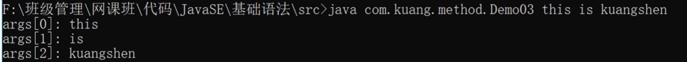

# 一、Java基础语法

## 基本数据

```java
int i=10;
int i2=010;
int i3=0x10
int i4=10_0000_0000
//i=10 i2=8 i3=16 i4=1000000000前缀0代表8进制，前缀0x代表16进制
```

## 类型转换

```java
//低---------------->高
//byte,short,char->int->long->float->double
```

强制转换 高->低

自动转换 低->高

## 变量、常量

```java
public class demo{
    static int a//类变量，方法直接引用
    int b//实例变量，需要将类实例化
    static final int d//常量，方法直接引用
    public static void main(String[] args){
        int c//局部变量
	}
}
```

## Javadoc


```java
package com.ddhen.base;
//类doc
/**
 * @author zsy
 * @version 1.0.1
 * @since 1.8
 */
public class Doc {
    String name;
	//方法doc
    /**
     * 
     * @param name
     * @return
     * @throws Exception
     */
    public String test(String name) throws Exception{
        return name;
    }
}

```

## Switch

```java
public class Switch {
    public static void main(String[] args) {
        char grade='c';
        switch (grade){
            case 'A':
                System.out.println('A');
                break;
            case 'B':
                System.out.println('B');
                break;
            case 'C':
                System.out.println('C');
                break;
            case 'D':
                System.out.println('D');
                break;
            default:
                System.out.println("wrong");
        }
    }
}
//不加break会产生case穿透现象
```

## 增强for循环

```java
public class demo{
    public static void main(String[] args){
        int[] nums={1,2,3,4,5};
        for(int x:nums){
            System.out.println(x);
        }
    }
}
```

## 命令行传参

运行一个程序时候再给它传递消息。依靠cmd实现



## 内存分析


## 静态代码块

```java
public class Person{
    {
        System.out.println('匿名代码块');
        //匿名代码块，创建对象实例时自动创建
    }
    
    static{
        System.out.println('静态代码块');
        //静态代码块
        //创建类时创建
    }
    public Person(){
        System.out.println('构造方法');
    }
    public static void main(String[] args){
        Person person1=new Person();
        System.out.println("=========");
        Person person2=new Person();
    }
}
/*
静态代码块
*/
```

## classpath和jar

### classpath

- 一个环境变量
- 指导JVM如何搜索class
- 数据类型是一个路径集合（；；）JVM依次查找，如果在某路径下找到则停止，若所有路径下都未找到则报错

### jar

jar包是zip模式的压缩文件，包含若干个.class文件

## 抽象类

```java
public abstract void Action(){
    public abstract dosomething(){}
   	public B(){}
}
```

抽象类无法实例化

抽象类中可以有普通方法

## 接口

只负责定义规范

```java
public interface UserService(){
    //接口中所有定义都默认是public abstract
    //接口简便写直接 返回值类型+方法名
    void add();
    void delete();
    
}
```

```java
public class UserServiceImpl implements UserService{
    public void add(){
        
    }
    public void delete(){
        
    }
}
```

接口不包含实例变量，但可以有static final常量(==并不常用==)

# 二、 面向对象

## 类

类是所有实例的==蓝图==

Java类由==变量==和==方法==组成

Java类可以包含以下类型的变量

| 变量类型 | 特点                                                 |
| -------- | ---------------------------------------------------- |
| 局部变量 | 在方法中定义的变量                                   |
| 成员变量 | 定义在类中，创建对象时实例化                         |
| 类变量   | 特殊的成员变量，加载类时被实例化，使用static进行修饰 |

## 方法

`System.out.println()`

`System`是系统类

`out`是一个对象

`println()`是`out`中的一个方法

### 类方法

```java
public class Demo01 {
    public static void main(String[] args) {
        int i=add(1,2);
        System.out.println(i);
    }
    //加上static后就是类方法，其他方法可以直接引用
    public static int add(int a,int b){
        return a+b;
    }
}
```

| **特性**          | **静态方法 (`static`)**      | **非静态方法 (实例方法)**  |
| :---------------- | :--------------------------- | :------------------------- |
| **归属对象**      | 属于类本身                   | 属于类的实例（对象）       |
| **调用方式**      | `类名.方法名()`              | `对象名.方法名()`          |
| **内存时机**      | 类加载时分配内存             | 对象实例化时分配内存       |
| **访问成员变量**  | 只能直接访问静态成员         | 可访问静态和非静态成员     |
| **`this` 关键字** | 不能使用（无当前对象上下文） | 可以使用（指向当前对象）   |
| **多态性**        | 不支持重写（编译时绑定）     | 支持重写（运行时动态绑定） |

### 构造方法

构造方法用于创建类的**实例**

类中如果没有定义任何构造方法，Java也会提供默认的**无参构造函数**

如果自己设计了构造方法，默认的无参构造方法便失效了。

```java
public class Person {
    String name;
    int age;

    public Person(String name, int age) {
        this.name = name;
        this.age = age;
    }
}
```

## 重载与重写

| 区别点   | 重载方法 | 重写方法                                       |
| :------- | :------- | :--------------------------------------------- |
| 参数列表 | 必须修改 | 一定不能修改                                   |
| 返回类型 | 可以修改 | 一定不能修改                                   |
| 异常     | 可以修改 | 可以减少或删除，一定不能抛出新的或者更广的异常 |
| 访问     | 可以修改 | 一定不能做更严格的限制（可以降低限制）         |

**重载（overload）**作用于同一个类或者一个子类之中

一个类里，方法名字**相同**，但参数列表不同，返回值也可能不同

重载要求==必须改变原本方法的参数列表==

```java
public class Demo {
    public static void main(String[] args) {
        func(2);
        func(2.1F);
    }
    public static void func(int a){
        System.out.println("这是一个整型");
    }

    public static void func(float a){
        System.out.println("这是一个浮点型");
    }
}
```

**重写（override）**作用于子类和父类之间

子类定义一个与父类具有相同名称，参数列表，返回类型的方法，但具体实现形式不同，**即外壳不变，核心重写！**

```java
class A{
    public void test(){
        System.out.println("A的非静态方法")
    }
}

public class B extends A{
    public void test(){
        System.out.println("B的非静态方法")
    }
}
```


## 继承

子类可以通过继承来得到父类的变量和方法

```java
class 父类{
}
class 子类 extends 父类{
}
```

```java
public class Student extends Person{
    
}//Student继承了Person类
//Ctrl+H可以打开继承树
//所有类都继承object类
//Java取消了多重继承
```

子类不继承构造方法，但子类的构造方法**需要**对父类的构造方法进行（显式或隐式）地调用

- 父类的构造方法没有参数列表，子类构造方法会自动调用父类方法
- 父类的构造方法有参数列表，子类需要使用`super`关键字调用构造器

```java
public class Demo {
    public static void main(String[] args) {
        B b = new B();
    }
}
class A{
    A(){
        System.out.println('a');
    }
}
class B extends A{
    B(){
        System.out.println('b');
    }
}
```

**继承的特性**

- 子类继承父类的非private属性和方法
- 子类可以自己定义属性
- 子类可以用自己的方式实现父类的方法（override）

## 多态

方法的多态，不同的对象调用同一方法，会有不同的效果

多态基于以下三个条件而存在：

（1）继承

（2）重写

（3）父类引用指向子类对象

Alt+insert: override 在子类中选择父类方法进行重写覆盖

Alt+enter 快速新建对象

**父类的引用可以指向子类的实例**

==对象能执行哪些方法看引用类型==（**左边**）

调用静态方法时，实际方法取决于==引用类型==
调用非静态方法时，实际方法取决于==实例类型==

### 静态方法

```java
class A{
    public static void staticTest(){
        System.out.println("A的静态方法");
    }
}

class B extends A{
    public static void staticTest(){
        System.out.println("B的静态方法");
    }
}

public class Demo{
    public static void main(String[] args) {
            A a=new A();
            A b=new B();
            a.staticTest();
            b.staticTest();
    }
}

/*
A的静态方法
A的静态方法
 */    
```

### 非静态方法

```java
class A{
    public void test(){
        System.out.println("A的非静态方法")
    }
}

public class B extends A{
    public void test(){
        System.out.println("B的非静态方法")
    }
}

public class demo{
    public static void main(){
        A a=new A();
        A b=new B();
        a.test();
        b.test();
    }
}
//如果子类没有重写该方法，会自动调用父类方法
//A的非静态方法
//B的非静态方法
```

## 抽象类

抽象类是特殊的类，不能被用于实例化对象

抽象类必须被**继承**才能使用

抽象类用`abstract`进行修饰

抽象类特点：

（1）不能实例化

（2）可以包含抽象方法

（3）可以包含具体方法

（4）可以包含构造方法

```java
abstract class Animal {
    private String name;
    public Animal(String name) {
        this.name = name;
    }
    // 具体方法
    public void eat() {
        System.out.println(name + " is eating.");
    }
    // 抽象方法
    public abstract void makeSound();
}
```

继承抽象类的子类一定要实现抽象方法

```java
// 具体子类
class Dog extends Animal {
    public Dog(String name) {
        super(name);
    }
    
    @Override
    public void makeSound() {
        System.out.println("Woof woof!");
    }
}
```

## 封装

为了防止类内部的数据和代码被随意更改，提供接口作为访问媒介

```java
public class Person{
    private String name;
    private int age;
	//访问接口
    public int getAge(){
      return age;
    }
    public String getName(){
      return name;
    }
    //赋值接口
    public void setAge(int age){
      this.age = age;
    }
    public void setName(String name){
      this.name = name;
    }
}
```

## 接口

**类**：包含属性和方法

**接口**：抽象方法的集合

`interface`可以被用于申明接口

接口只能包含final和static变量

```java
[可见度] interface 接口名称 [extends 其他的接口名] {
        // 声明变量
        // 抽象方法
}
```

类(抽象类)使用`implements`关键字实现接口

```java
class ... implements 接口名称[, 其他接口名称, 其他接口名称..., ...] ...
```

接口可以继承接口

```java
// 文件名: Sports.java
public interface Sports
{
   public void setHomeTeam(String name);
   public void setVisitingTeam(String name);
}
 
// 文件名: Football.java
public interface Football extends Sports
{
   public void homeTeamScored(int points);
   public void visitingTeamScored(int points);
   public void endOfQuarter(int quarter);
}
```

## 包机制

`package`机制的引入解决了类名冲突的问题（不同的文件夹中可能存在相同名字的类）

**一个类总是只属于某个包**，完整类名是`包名.类名`

JVM只看完整类名

### 静态导入包

```java
import static java.lang.Math.random;
public class Test{
    public static void main(String[] args){
        System.out.println(random());
        //达到简略的目的，不用写math.random()
    }
}
```


# 三、Java基础类（java.lang)

## 字符串

### String

### StringBuilder

`append`

`insert`

# 四、Java工具类（java.util）

## Collection

`stream`

## 集合

### Hashset

`add`

`remove`

`contains`

## 列表

### ArrayList

### LinkedList

## 字典

### HashMap

实现了基于键值对的数据存储方式

使用“键(key)”

# 四、JavaIO(java.io)

**流**：内存与存储设备之间传输数据的通道，双向

**输入流**：将存储设备的内容读入到内存中

**输出流**：将内存的内容读入到存储设备

**字节流**：以字节为单位，可以读写所有的数据

**字符流**：以字符为单位，只能读写文本

## 字节流

**抽象类**

输入：InputStream

输出：OutputStream

### FileInputStream

**1、逐步读取每个字符**

此时`read()`返回字节的ASCII码

```java
public class Demo1 {
    public static void main(String[] args) throws Exception{
        //1创建FileInputStream,参数指明文件路径
        FileInputStream fileInputStream=new FileInputStream("src/com/ddhen/method/Demo2/text/a.txt");
        //2读取文件
        //fileInputStream.read();
        int data=0;
        //单个字节读取,read()返回int类型的ASCII码
        while((data=fileInputStream.read())!=-1){
            System.out.println((char)data);
        }
        String encoding = System.getProperty("file.encoding");
        System.out.println("当前平台的默认编码是: " + encoding);
        //UTF-8编码，每个字母占1字节
    }
}
```

**2、一次读取多个**

多个字符，`read(byte[])`返回`int`即读取到的字符个数，如果读取个数为0，返回-1

```java
public class Demo1 {
    public static void main(String[] args) throws Exception{
        //1创建FileInputStream,参数指明文件路径
        FileInputStream fileInputStream=new FileInputStream("src/com/ddhen/method/Demo2/text/a.txt");
        //2读取文件
        //fileInputStream.read();
        //一次读取多个字节，使用byte[]数组存入，8位
       byte[] buff=new byte[3];
       int count=0;
       while ((count=fileInputStream.read(buff))!=-1){
           System.out.println(new String(buff,0,count));
       }
    }
}
/*
faw
fsf
wqx
wqw
x
*/
```

### FileOutputStream

输出流对象创建时，构造函数需要传入两个参数

`name`:文件路径

`append`:默认为覆盖原文件，true在原文件末尾添加

`write()`有以下可选参数`int` `byte[]`

```java
public class Demo1 {
    public static void main(String[] args) throws Exception{
        //1创建文件字节输出流对象
        FileOutputStream fileOutputStream=new FileOutputStream("src/com/ddhen/method/Demo2/text/b.txt",true);
        //2写入文件,write参数为byte[]数组
       String s="hello";
       fileOutputStream.write(s.getBytes());
        //3关闭输出流
        fileOutputStream.close();
    }
}
```

### 练习：复制图片

```java
public class Demo1 {
    public static void main(String[] args) throws Exception{
        //1、创建输入流对象
        FileInputStream fis=new FileInputStream("src/com/ddhen/method/Demo2/text/软考证书.pdf");
        //2、创建输出流对象
        FileOutputStream fos=new FileOutputStream("src/com/ddhen/method/Demo2/text/软考证书(副本).pdf");
        //3、创建缓存
        byte[] buffer=new byte[1024];
        int count=0;
        while((count=fis.read(buffer))!=-1){
            fos.write(buffer);
        }
        //4关闭
        fis.close();
        fos.close();
    }
}
```

## 字节缓冲流

缓冲流

在上述的操作中，我们每次read()就要有相应的write()操作，访问磁盘次数多，效率低下，字节缓冲流解决了这一问题

- 提高IO效率，减少访问磁盘的次数
- 数据存储在缓冲区中，调用flush将缓冲区内容写入文件中，也可以直接close

### BufferdInputStream

此时的`read()`操作先将8k字节读入缓冲区，之后如果缓冲区未被读完，则不会与磁盘进行交互

```java
public class Demo1 {
    public static void main(String[] args) throws Exception{
        //1创建缓冲流
        FileInputStream fis=new FileInputStream("src/com/ddhen/method/Demo2/text/a.txt");
        BufferedInputStream bis=new BufferedInputStream(fis);
        //2读入
        int count=0;
        while((count=bis.read())!=-1){
            System.out.print((char)count);
        }
        System.out.println();
        byte[] buff=new byte[1024];
        while((count=bis.read(buff))!=-1){
            System.out.println(new String(buff,0,count));
        }
        //关闭
        bis.close();
    }
}
```

### BufferdOutputStream

注意，此时的`write`只是将字节写入8kb的缓存区，注意flush调用刷新到磁盘

```java
public class Demo1 {
    public static void main(String[] args) throws Exception{
        //1创建缓冲流
       FileOutputStream fos=new FileOutputStream("src/com/ddhen/method/Demo2/text/d.txt");
        BufferedOutputStream bos=new BufferedOutputStream(fos);
        //2读入
        String s="asdas";
        for (int i = 0; i < 10; i++) {
            bos.write(s.getBytes());
        }
        bos.flush();
        //关闭
        //bos.close();close会自动调用flush
    }
}
```

## 对象流

实现内存中的对象写入硬盘，或者从硬盘读取数据转化为对象

`readObject()`从流中读取一个对象

`writeObject()`将指定对象写入到流中

**序列化**：将数据结构或对象转换成一种可存储或可传输格式的过程

**反序列化**：序列化的逆过程，即将序列化后的数据重新还原成原始的数据结构或对象

### ObjectOutputStream

所有需要序列化的类都必须`implements`接口`Serializable`

```java
public class Student implements Serializable {}
```

```java
public class Demo1 {
    public static void main(String[] args) throws Exception{
       //1创建对象流
        FileOutputStream fos=new FileOutputStream("src/com/ddhen/method/Demo2/text/stu.bin");
        ObjectOutputStream oos=new ObjectOutputStream(fos);
        //2实现序列化
        Student zsy=new Student("ddhen",20);
        oos.writeObject(zsy);
       //3关闭
       oos.close();
    }
}
```

### ObjectInputStream

`readObject()`的返回值为`Objetct`类型，需要强制转换

```java
public class Demo1 {
    public static void main(String[] args) throws Exception{
       //1创建对象流
        FileInputStream fis=new FileInputStream("src/com/ddhen/method/Demo2/text/stu.bin");
        ObjectInputStream ois=new ObjectInputStream(fis);
        //2读取对象
        Student stu=(Student) ois.readObject();
        System.out.println(stu);
        //3关闭
        ois.close();
    }
}
```

### 序列化与反序列化注意事项

- 序列化类必须实现Serializable接口
- 序列化类中的对象属性要求实现Serializable接口
- 序列化版本号ID`long`,保证序列化的类和反序列化的类是同一个类

## 字符流

`ISO-8859-1`:收录ASCII外，还包括西欧、泰语等

`UTF-8`:针对Unicode码表的可变长度字符编码，汉字一个字三个字节

`GB2312`:简体中文

`GBK`:简体中文，扩充

**抽象类**

输入：Reader

输出：Writer

### FileReader

用来读取字符文件的便捷类，此类构造方法假定默认字符编码和默认字节缓冲区大小都是适当的

```java
public class Demo1 {
    public static void main(String[] args) throws Exception{
       //1创建文件字符输入流
        FileReader fr=new FileReader("src/com/ddhen/method/Demo2/text/a.txt");
        //2读取,一次读3个字节
        int data=0;
        data=fr.read();
        System.out.println((char)data);
        char[] buffer=new char[6];
        fr.read(buffer);
        System.out.println(new String(buffer));
    }
}
//四
//川大学周苏洋    
```

### FileWriter

文档复制练习

```java
public class Demo1 {
    public static void main(String[] args) throws Exception {
        //1创建文件字符输入流,输出流
        FileReader fr = new FileReader("src/com/ddhen/method/Demo2/text/a.txt");
        FileWriter fw=new FileWriter("src/com/ddhen/method/Demo2/text/b.txt",true);
        //2传输
        int count=0;
        char[] buffer=new char[1024];
        while ((count=fr.read(buffer))!=-1){
            fw.write(buffer,0,count);
        }
        //3关闭
        fr.close();
        fw.close();
    }
}
```

==注意==：

FileReader和FileWriter复制文本文件，不能复制图片或二进制文件

复制图片或者pdf类型的文件只能使用字节流

## 字符缓冲流

### BufferdReader

### BufferdWriter

## 转换流

# 三、多线程

## 基础概念

**进程**是程序的一次==执行过程==，系统资源分配的单位

一个进程包含多个**线程**，线程是CPU调度和执行的单位

## 线程创建

### 继承Thread类

方法1：继承Thread类，重写run()方法，调用start开启线程

```java
public class TestThread1 extends  Thread{
    @Override
    public void run() {
        //run方法线程体
        for (int i = 0; i < 20; i++) {
            System.out.println("这是run方法线程--"+i);
        }
    }

    public static void main(String[] args) {
        //main线程，主线程

        //创建一个线程对象
        TestThread1 testThread1=new TestThread1();

        //调用start()开启线程
        testThread1.start();
        for (int i = 0; i < 20; i++) {
            System.out.println("这是主线程--"+i);
        }
    }
}
//主线程与run线程交替打印
//
```

### 实现Runable接口（推荐）

实现Runable接口启动线程需要用线程对象进行代理

==相较于直接继承避免了单继承局限性，灵活方便，方便一个资源被多个线程使用==

**注意**：只有`Thread`对象才是真正的线程对象

```java
public class TestThread2 implements Runnable{
    @Override
    public void run() {
        //run方法线程体
        for (int i = 0; i < 20; i++) {
            System.out.println("这是run方法线程--"+i);
        }
    }

    public static void main(String[] args) {
        //创建Runnable接口的实现类对象
        TestThread2 testThread2=new TestThread2();
        //创建线程对象，通过线程对象代理开启线程
        new Thread(testThread2).start();

        //调用start()开启线程
        for (int i = 0; i < 20; i++) {
            System.out.println("这是主线程--"+i);
        }
    }
}
```

### 并发问题

当多个线程同时调用同一个资源时，可能造成冲突，产生不一致性

### 龟兔赛跑(练习)

```java
//龟兔赛跑
public class Race implements Runnable{
    @Override
    public void run() {
        if(Thread.currentThread().getName().equals("兔子")) {
            for (int i = 0; i < 100; i+=10) {
                System.out.println("兔子跑了" + i + "米");
                try {
                    Thread.sleep(1);
                }catch(InterruptedException e){
                    e.printStackTrace();
                }
            }
        }else{
            for (int i = 0; i < 100; i++) {
                System.out.println("乌龟跑了" + i + "米");
            }
        }
        System.out.println(Thread.currentThread().getName()+"到达终点");
    }

    public static void main(String[] args) {
        Race race=new Race();
        new Thread(race,"兔子").start();
        new Thread(race,"乌龟").start();
    }
}
```

### 实现Callable接口

## Lamda表达式

### **函数式接口**

只包含唯一一个抽象方法，即为函数式接口

通过lambda表达式来创建该接口对象

```java
public interface Runnable{
    public abstract void run()
}
```

### 一个案例

```java
public class LamdaTest {
    static void send(message ms){
        String status=ms.sendmessage("顺丰","周苏洋");
        System.out.println(status);
    }

    public static void main(String[] args) {
        //()->{},()中填写唯一抽象方法的参数，{}中填写具体的函数实现方法
        //()->
        send(((type, name) -> {
            System.out.println(type+"寄快递"+name);
            return "success";
        }));
    }
}

interface message{
    abstract String sendmessage(String type,String name);
}
```

## 静态代理

真实对象和代理对象都要实现同一个接口

代理对象代理真实角色

**优势**

- 代理对象可以做很多真实对象无法完成的事情
- 真实对象专注做自己的事情

## 线程状态

### 线程停止

设置flag标志位去控制线程的中断

```java
public class StopTest implements Runnable{
    private boolean flag=true;
    @Override
    public void run() {
        int i=0;
        while (flag){
            System.out.println("线程进行中--"+i++);
        }
        System.out.println("线程停止了");
    }

    void stop(){
        this.flag=false;
    }
    public static void main(String[] args) {
        StopTest stopTest=new StopTest();
        new Thread(stopTest).start();
        for (int i = 0; i < 1000; i++) {
            if(i==900){
                stopTest.stop();
            }
            System.out.println("主线程进行到--"+i);
        }
    }
}
```

### 线程休眠

- sleep
