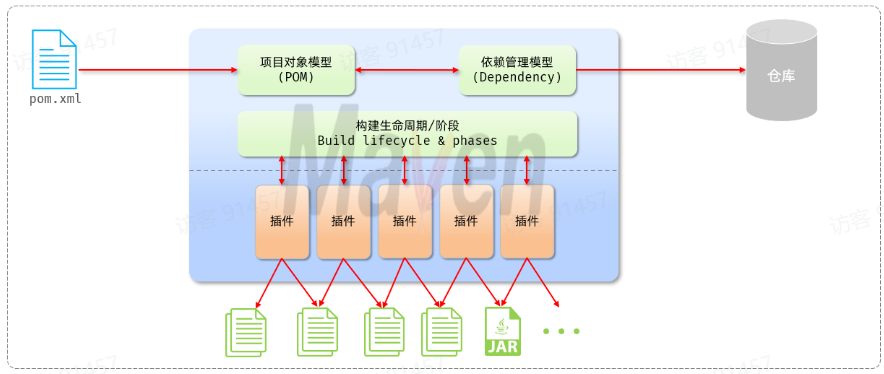
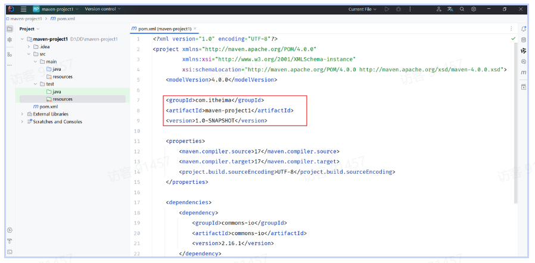
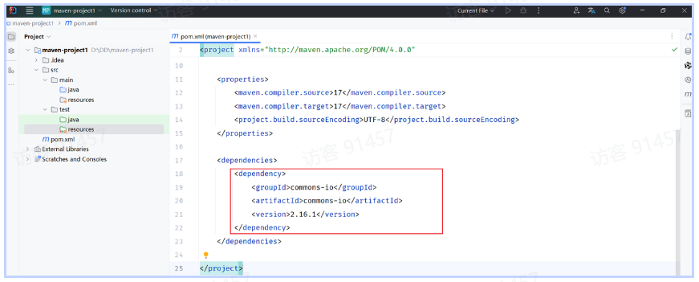

# Maven

## 1. Maven基础

==Maven有三大作用==

- 依赖管理
- 项目构建
- 同一项目结构

### 1.1  依赖管理

Maven可以管理项目所需要的jar包

**传统方法**

一个project有一个单独的lib仓库，程序员从网上下载好jar包存入lib目录，项目结构如下：

```
common_project
	> lib
	  hutool-all-5.8.27.jar
	  ......
	> src
```

**Maven方法**

maven项目利用`pom.xml`管理项目所需要的jar包，项目结构如下：

```
maven_project
	> src
	pom.xml
```

所谓pom，即项目对象模型（Project Object Model），将项目抽象成一个对象，项目拥有自己的坐标

假设我们想要引入`hutool-all-5.8.27.jar`,在`pom.xml`中写入如下语句

```xml
<dependency>
    <groupId>cn.hutool</groupId>
    <artifactId>hutool-all</artifactId>
    <version>5.8.27</version>
</dependency>
```

`groupId`：组织名

`artifactId`：模块名

`Version`：版本号

这三个字段组成了资源的唯一标识**坐标**，通过**坐标**定位到所需资源（jar包）的位置

### 1.2  项目构建

### 1.3  同一项目结构

### 1.4  POM文件

`pom.xml`的经典文件结构如下：

```xml
<project xmlns="http://maven.apache.org/POM/4.0.0"
         xmlns:xsi="http://www.w3.org/2001/XMLSchema-instance"
         xsi:schemaLocation="http://maven.apache.org/POM/4.0.0
         http://maven.apache.org/xsd/maven-4.0.0.xsd">

    <!-- 1. POM模型版本 -->
    <modelVersion>4.0.0</modelVersion>

    <!-- 2. 当前项目坐标 -->
    <groupId>com.example</groupId>
    <artifactId>demo-project</artifactId>
    <version>1.0.0</version>
    <packaging>jar</packaging>

    <!-- 3. 项目描述信息 -->
    <name>Demo Project</name>
    <description>A simple Maven project</description>

    <!-- 4. 继承父工程（可选） -->
    <parent>
        <groupId>org.springframework.boot</groupId>
        <artifactId>spring-boot-starter-parent</artifactId>
        <version>3.2.0</version>
    </parent>

    <!-- 5. 属性管理 -->
    <properties>
        <java.version>17</java.version>
        <project.build.sourceEncoding>UTF-8</project.build.sourceEncoding>
    </properties>

    <!-- 6. 依赖管理 -->
    <dependencies>
        <dependency>
            <groupId>org.springframework.boot</groupId>
            <artifactId>spring-boot-starter-web</artifactId>
        </dependency>

        <dependency>
            <groupId>org.junit.jupiter</groupId>
            <artifactId>junit-jupiter</artifactId>
            <scope>test</scope>
        </dependency>
    </dependencies>

    <!-- 7. 构建配置 -->
    <build>
        <plugins>
            <plugin>
                <groupId>org.apache.maven.plugins</groupId>
                <artifactId>maven-compiler-plugin</artifactId>
                <version>3.11.0</version>
                <configuration>
                    <source>17</source>
                    <target>17</target>
                </configuration>
            </plugin>
        </plugins>
    </build>

    <!-- 8. 仓库配置（可选） -->
    <repositories>
        <repository>
            <id>central</id>
            <url>https://repo.maven.apache.org/maven2</url>
        </repository>
    </repositories>

</project>
```


## 2. Maven模型



Maven模型包含三个核心部分：

- 项目对象模型（Project Object Model）
- 依赖管理模型 (Dependency)
- 构建生命周期/阶段 (Build lifecycle & phases)

### 2.1 项目对象模型

项目被抽象成一个对象，标记在`pom.xml`文件中

对应的`pom.xml`中的部分：



### 2.2 依赖管理模型




## 3. Maven仓库

Maven仓库是一个用于存储`jar包`和`插件`的目录，`pom.xml`中的坐标指向这个文件夹中的内容

Maven仓库有三种：

- 本地仓库：本地计算机上的一个目录

- 中央仓库：由Maven团队维护的仓库

- 远程仓库：企业搭建的私有仓库

**依赖引入的流程**

（1）`pom.xml`中标记了一个依赖坐标

（2）查找`本地仓库`是否有对应的依赖

（3）如果有则直接引用，没有去`远程仓库`或`中央仓库`进行下载                                                                                                                                                                                                                                                                                                                                                                                                                                                                                                                                                                                                                                                                                                                                                                                                                                                                                                                                                                                                                                                                                                                    


## 4.  依赖管理                    


## 5.  生命周期

生命周期描述了一次项目的构建，经历了哪些阶段

`clean` —>`compile`—>`test`—>`package`—>`install`
