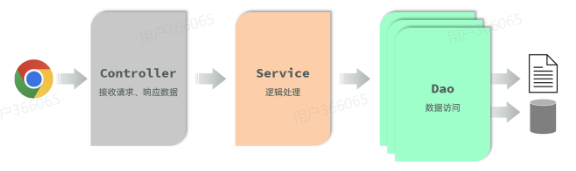

# Springboot

## 1. 概述

Spring家族中最基础最核心的技术是`SpringFramwork`，提供了很多实用功能，包括：`依赖注入`，`事务管理`，`web开发支持`，`数据访问`，`消息服务`

## 2. HTTP

### 特点

Hyper Text Transfer Protocol(超文本传输协议)，规定了浏览器与服务器之间数据传输的规则。有如下特点：

- **基于TCP协议**
- **基于请求-响应模型**
- **HTTP协议是无状态协议**

## 3. 解耦

### 3.1 三层结构

**单一职责原则**：一个类或一个方法。只做一件事，只管一块功能

前后端交互的逻辑可以分为核心的三个部分：

（1）**数据访问**：负责业务数据的维护操作，包括增、删、改、查等操作。

（2）**逻辑处理**：负责业务逻辑处理的代码。

（3）**请求处理**：响应数据：负责，接收页面的请求，给页面响应数据。

- Controller：控制层。接收前端发送的请求，对请求进行处理，并响应数据。
- Service：业务逻辑层。处理具体的业务逻辑。
- Dao：数据访问层(Data Access Object)，也称为持久层。负责数据访问操作，包括数据的增、删、改、查。

**完整流程：**

`前端`：发起请求——>`Controller`：接收请求——>`Controller`：调用Service——>`Service`：调用Dao——>`Dao`：从数据库中取出数据,传递给Service——>`Service`：对数据进行逻辑处理——>`Controller`：接收数据，返回给前端

### 3.2 分层解耦

对于`Controller`，`Service`，在之前的代码中，如果要调用下层的应用，采取的方法是：

`new UserServiceImpl()`

`new UserDaoImpl()`

这样的写法存在严重的`耦合`问题，如果我们要更换下层的实现类，也需要修改上层的`new`代码，`Controller`耦合了`Service`、`Service`耦合了`Dao`

==解决方案如下==：

- 提供一个容器，容器中存储一些对象(例：UserService对象)
- Controller程序从容器中获取UserService类型的对象

==相关概念==：

- **控制反转（IOC）**： Inversion Of Control，简称**IOC**。对象的创建控制权由程序自身转移到外部（容器）
- **依赖注入（DI）**：Dependency Injection，简称**DI**。容器为应用程序提供运行时，所依赖的资源，称之为依赖注入。
- **bean对象**：IOC容器中创建、管理的对象，称之为：bean对象。

