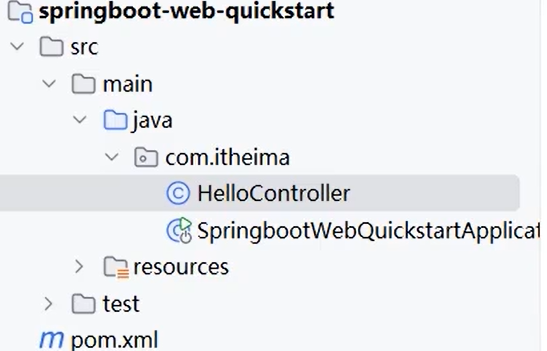
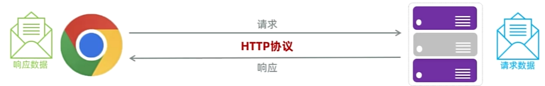

# Springboot

## 0. 入门程序



Maven 提供项目结构和依赖管理能力，下载 Spring Boot 需要的 jar 包、编译代码、打包项目
Spring Boot 在 Maven 项目结构中实现 Web 应用功能（Springboot其实就是引入了）

`SpringbootWebQuickstartApplication`

**启动整个 Spring Boot 应用**

```java
@SpringBootApplication //包含了@ComponentScan，自动扫描当前目录下的Controller,注册到Spring容器中
public class SpringbootWebQuickstartApplication {

    public static void main(String[] args) {
        SpringApplication.run(SpringbootWebQuickstartApplication.class, args);
    }

}
```


`HelloController`

**Controller 是处理请求的类，Mapping 是把某个请求路径绑定到 Controller 中某个方法上的规则。**

```java
package com.itheima;
import org.springframework.web.bind.annotation.RequestMapping;
import org.springframework.web.bind.annotation.RestController;

@RestController  // 表示当前类是一个请求处理类
public class HelloController {
    @RequestMapping("/hello") //url
    public String hello(String name) {
        System.out.println("name : " + name);
        return "Hello " + name + "~";
    }
}
```


##   1. 概述

Spring家族中最基础最核心的技术是`SpringFramwork`，提供了很多实用功能，包括：`依赖注入`，`事务管理`，`web开发支持`，`数据访问`，`消息服务`


## 2. HTTP

### 2.1 特点

Hyper Text Transfer Protocol(超文本传输协议)，规定了浏览器与服务器之间数据传输的规则。有如下特点：



- **基于TCP协议**：面向连接，安全可靠
- **基于请求-响应模型**：一次请求一次响应
- **HTTP协议是无状态协议**：每一次请求和响应相互独立


### 2.2 请求协议

```http
POST /brand HTTP/1.1                                          #请求行
Accept: application/json, text/plain, */*                     #请求头
Accept-Encoding: gzip, deflate, br
Accept-Language: zh-CN,zh;q=0.9
Content-Length: 161
Content-Type: application/json;charset=UTF-8
Cookie: Idea-8296eb32=841b16f0-0cfe-495a-9cc9-d5aaa71501a6; JSESSIONID=0FDE4E430876BD9C5C955F061207386F
Host: localhost:8080
User-Agent: Mozilla/5.0 (Windows NT 10.0; Win64; x64) AppleWebKit/537.36 (KHTML, like Gecko) Chrome/...                                #请求头

{"status":1,"brandName":"黑马","companyName":"黑马程序员","id":"","description":"黑马程序员"}                         #请求体
```


==**请求行**==

`POST /brand HTTP/1.1` 

`请求方式` `请求路径` `协议版本`

请求方式：

（1）`GET`：向服务器获取数据，没有请求体

（2）`POST`：向服务器推送数据，有请求体

**==请求头==**

一些补充说明信息

key : value格式

==**请求体**==

用来存放客户端真正要提交给服务器的数据。


Tomcat对HTTP的请求数据解析，并封装为`HttpServletRequest`类（面向对象）,在调用`Controller`中方法时作为参数传递给方法

```java
@RestController
public class RequestController {
    @RequestMapping("/request")
    public String request(HttpServletRequest request){
    }
}
```


### 2.3 响应协议

```http
HTTP/1.1 200 OK
Content-Type: application/json
Transfer-Encoding: chunked
Date: Tue, 10 May 2022 07:51:07 GMT
Keep-Alive: timeout=60
Connection: keep-alive

[{id: 1, brandName: "阿里巴巴", companyName: "腾讯计算机系统有限公司", description: "玩玩玩"}]
```


==响应行==

`HTTP/1.1 200 OK`

`协议` `状态码` `描述`

| 状态码 | 含义       | 说明                                                         |
| ------ | ---------- | ------------------------------------------------------------ |
| 1xx    | 信息响应   | 请求已经收到，服务器正在继续处理                             |
| 2xx    | 成功       | 请求已经被服务器成功接收、理解、处理                         |
| 3xx    | 重定向     | 请求的资源位置发生变化，需要客户端进一步操作，重新请求，含有location |
| 4xx    | 客户端错误 | 请求有问题，通常是客户端发送的请求不正确                     |
| 5xx    | 服务器错误 | 服务器处理请求时出错                                         |

==响应头==

一些补充说明信息

key : value格式

==响应体==

用来存放服务器返回给浏览器的数据。


Web服务器对HTTP协议的响应数据进行了封装`HttpServletResponse`，并在调用`Controller`方法的时候传递给了该方法。

## 3. 解耦

### 3.1 三层结构

**单一职责原则**：一个类或一个方法。只做一件事，只管一块功能

前后端交互的逻辑可以分为核心的三个部分：

（1）**数据访问**：负责业务数据的维护操作，包括增、删、改、查等操作。

（2）**逻辑处理**：负责业务逻辑处理的代码。

（3）**请求处理**：响应数据：负责，接收页面的请求，给页面响应数据。


- Controller：控制层。接收前端发送的请求，对请求进行处理，并响应数据。
- Service：业务逻辑层。处理具体的业务逻辑。
- Dao：数据访问层(Data Access Object)，也称为持久层。负责数据访问操作，包括数据的增、删、改、查。

**完整流程：**

`前端`：发起请求——>`Controller`：接收请求——>`Controller`：调用Service——>`Service`：调用Dao——>`Dao`：从数据库中取出数据,传递给Service——>`Service`：对数据进行逻辑处理——>`Controller`：接收数据，返回给前端


### 3.2 分层解耦

对于`Controller`，`Service`，在之前的代码中，如果要调用下层的应用，采取的方法是：

`new UserServiceImpl()`

`new UserDaoImpl()`

这样的写法存在严重的`耦合`问题，如果我们要更换下层的实现类，也需要修改上层的`new`代码，`Controller`耦合了`Service`、`Service`耦合了`Dao`

==解决方案如下==：

- 提供一个容器，容器中存储一些对象(例：UserService对象)
- Controller程序从容器中获取UserService类型的对象

==相关概念==：

- **控制反转（IOC）**： Inversion Of Control，简称**IOC**。对象的创建控制权由程序自身转移到外部（容器）
- **依赖注入（DI）**：Dependency Injection，简称**DI**。容器为应用程序提供运行时，所依赖的资源，称之为依赖注入。
- **bean对象**：IOC容器中创建、管理的对象，称之为：bean对象。

​                                             

​             
