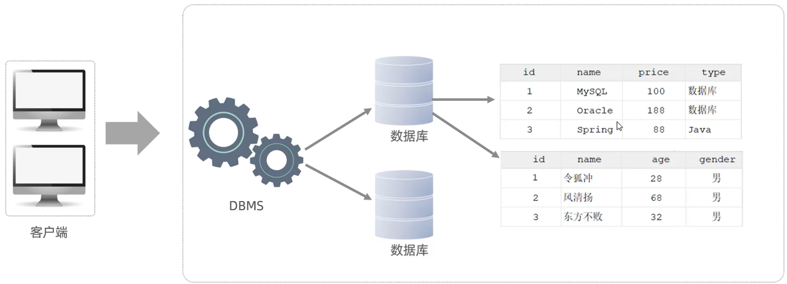

# MySQL

# 数据模型



**客户端(Cilent)：**用户界面或应用程序，是用户和数据库系统交互的地方（Navicat）

**数据库管理系统(DBMS)：**==数据库服务器中==一套软件，负责接收客户端的请求，并对数据库进行操作，处理操作指令

**数据库（Database）：**==数据库服务器中==存储数据库的实体

一个管理系统可以对应多个独立的数据库，每个数据库中又存储了多个数据表（table）

# SQL

| **DDL** | **Data Definition Language**   | 数据定义语言，用来定义数据库对象（数据库，表，字段）   |
| ------- | ------------------------------ | ------------------------------------------------------ |
| **DML** | **Data Manipulation Language** | 数据操作语言，用来对数据库表中的数据进行增删改         |
| **DQL** | **Data Query Language**        | 数据查询语言，用来查询数据库中表的记录                 |
| **DCL** | **Data Control Language**      | 数据控制语言，用来创建数据库用户、控制数据库的访问权限 |

# DDL

数据定义语言，用来定义数据库对象（数据库，表，字段）

## 数据库操作

1) 查询所有数据库

```sql
show databases;
```

```
mysql> show databases;
+--------------------+
| Database           |
+--------------------+
| information_schema |
| learning_base      |
| mysql              |
| performance_schema |
| sys                |
+--------------------+
```

2) 切换数据库

   一个服务器中有多个数据库，首先需要切换数据库选择需要进行后续操作的那一个

```sql
use sys;
```

```
mysql> use sys
Database changed
```

3. 查询当前数据库

```sql
select database();
```

```
mysql> select database();
+------------+
| database() |
+------------+
| sys        |
+------------+
```

4. 创建数据库

```sql
create database [ if not exists ] 数据库名 [ default charset 字符集 ] [ collate 排序
规则 ] ;
```

5. 删除数据库

```sql
drop database [ if exists ] 数据库名 ;
```


## 表操作

### 查询创建

（1）**查询当前数据库所有表**

```sql
show tables;
```

```
mysql> show tables;
+-----------------------------------------------+
| Tables_in_sys                                 |
+-----------------------------------------------+
| host_summary                                  |
| host_summary_by_file_io                       |
| host_summary_by_file_io_type                  |
| host_summary_by_stages                        |
| host_summary_by_statement_latency             |
| host_summary_by_statement_type                |
| innodb_buffer_stats_by_schema                 |
| innodb_buffer_stats_by_table                  |
| innodb_lock_waits                             |
| io_by_thread_by_latency                       |
| io_global_by_file_by_bytes                    |
| io_global_by_file_by_latency                  |
|......                                         |
+-----------------------------------------------+
```

（2）**查看指定表结构**

查看到指定表的字段，字段的类型、是否可以为NULL，是否存在默认值等信息。

`desc`实际上就是describe

```sql
desc 表名 ;
```

```
mysql> desc users;
+------------+------------------------+------+-----+-------------------+-------------------+
| Field      | Type                   | Null | Key | Default           | Extra             |
+------------+------------------------+------+-----+-------------------+-------------------+
| id         | int                    | NO   | PRI | NULL              | auto_increment    |
| username   | varchar(50)            | NO   |     | NULL              |                   |
| email      | varchar(100)           | YES  | UNI | NULL              |                   |
| age        | tinyint unsigned       | YES  |     | 18                |                   |
| gender     | enum('男','女','未知') | YES  |     | 未知              |                   |
| created_at | timestamp              | YES  |     | CURRENT_TIMESTAMP | DEFAULT_GENERATED |
+------------+------------------------+------+-----+-------------------+-------------------+
```

（3）**查询指定表的建表语句**

通过这条指令，主要是用来查看建表语句的

```sql
show create table 表名 ;
```

```
 users | CREATE TABLE `users` (
  `id` int NOT NULL AUTO_INCREMENT COMMENT '主键ID',
  `username` varchar(50) COLLATE utf8mb4_general_ci NOT NULL COMMENT '用户名',
  `email` varchar(100) COLLATE utf8mb4_general_ci DEFAULT NULL COMMENT '电子邮箱',
  `age` tinyint unsigned DEFAULT '18' COMMENT '年龄',
  `gender` enum('男','女','未知') COLLATE utf8mb4_general_ci DEFAULT '未知' COMMENT '性别',
  `created_at` timestamp NULL DEFAULT CURRENT_TIMESTAMP COMMENT '注册时间',
  PRIMARY KEY (`id`),
  UNIQUE KEY `email` (`email`)
) ENGINE=InnoDB DEFAULT CHARSET=utf8mb4 COLLATE=utf8mb4_general_ci
```

（4）**创建表结构**

```sql
CREATE TABLE 表名(
字段1 字段1类型 [ COMMENT 字段1注释 ],
字段2 字段2类型 [COMMENT 字段2注释 ],
字段3 字段3类型 [COMMENT 字段3注释 ],
......
字段n 字段n类型 [COMMENT 字段n注释 ]
) [ COMMENT 表注释 ] ;
```


### 修改

（1）**添加字段**

```sql
ALTER TABLE 表名 ADD 字段名 类型 (长度) [ COMMENT 注释 ] [ 约束 ];
```

例

```sql
ALTER TABLE emp ADD nickname varchar(20) COMMENT '昵称';
```

（2）**修改数据类型**

```sql
ALTER TABLE 表名 MODIFY 字段名 新数据类型 (长度);
```

（3） **修改字段名和字段类型**

```sql
ALTER TABLE 表名 CHANGE 旧字段名 新字段名 类型 (长度) [ COMMENT 注释 ] [ 约束 ];
```

（4）**删除字段**

```sql
ALTER TABLE 表名 DROP 字段名;
```

（5）**修改表名**

```sql
ALTER TABLE 表名 RENAME TO 新表名;
```


### 删除

（1）**删除表**

```sql
DROP TABLE [ IF EXISTS ] 表名;
```

（2）**删除指定表, 并重新创建表**

```sql
TRUNCATE TABLE 表名;
```


# DML

Data Manipulation Language（数据操作语言），用来对数据库中表的数据记录进行增、删、改操作

- 添加数据（INSERT）
- 修改数据（UPDATE）
- 删除数据（DELETE）

## 添加数据

（1）**给指定字段添加数据**

```sql
INSERT INTO 表名 (字段名1, 字段名2, ...) VALUES (值1, 值2, ...);
```

（2）**给全部字段添加数据**

```sql
INSERT INTO 表名 VALUES (值1, 值2, ...);
```

（3） **批量添加数据**

```sql
INSERT INTO 表名 (字段名1, 字段名2, ...) VALUES (值1, 值2, ...), (值1, 值2, ...), (值
1, 值2, ...) ;
```

## 修改数据

```sql
UPDATE 表名 SET 字段名1 = 值1 , 字段名2 = 值2 , .... [ WHERE 条件 ] ;
```

## 删除数据

```sql
DELETE FROM 表名 WHERE 条件;
```

`DELETE` 会根据 `WHERE` 条件扫描数据，然后将符合条件的记录逐行删除。

可以不写条件但会==整张表删除==

# DQL

Data Query Language(数据查询语言)，用来查询库中表的记录。在一个正常的业务系统中，查询操作的频次是要远高于增删改的

## 基本语法

```sql
SELECT
	字段列表
FROM
	表名列表
WHERE
	条件列表
GROUP BY
    分组字段列表
HAVING
	分组后条件列表
ORDER BY
	排序字段列表
LIMIT
	分页参数
```


## 基础查询

基础查询不带任何查询条件

（1）查询多个字段

```sql
select * from 表名;
```

```sql
SELECT 字段1, 字段2, 字段3 ... FROM 表名 ;
```

```
mysql> select name from emp;
+--------+
| name   |
+--------+
| 张三   |
| 李美   |
| 王志强 |
| 赵敏   |
| 孙磊   |
| 周芳   |
| 吴军   |
| 郑静   |
| 冯杰   |
| 陈莹   |
+--------+
```

（2）字段设置别名

```sql
SELECT 字段1 [ AS 别名1 ] , 字段2 [ AS 别名2 ] ... FROM 表名;
SELECT 字段1 [ 别名1 ] , 字段2 [ 别名2 ] ... FROM 表名;
```

（3）去除重复记录

```sql
SELECT DISTINCT 字段列表 FROM 表名;
```

`DISTINCT`字段后面可以跟多个字段，只有一行中所有指定字段值与另一行完全相同时，才被视为重复数据


## 条件查询

常用运算符

