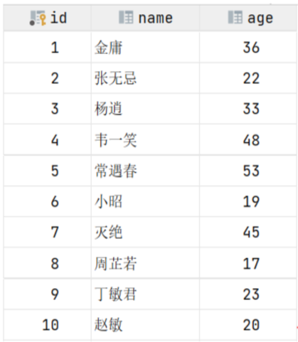
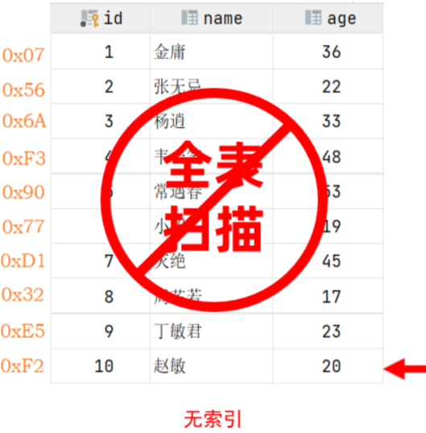
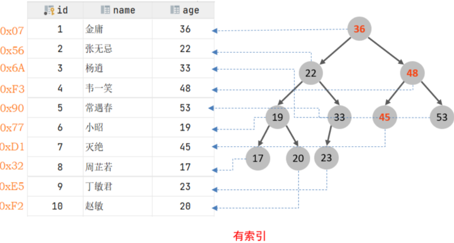
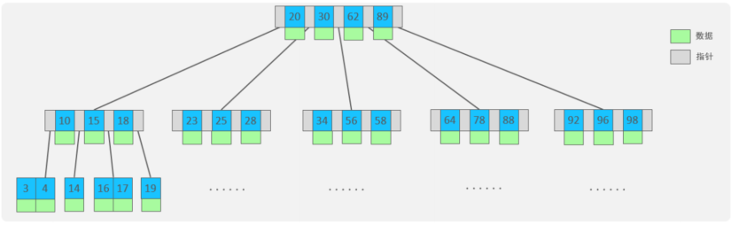
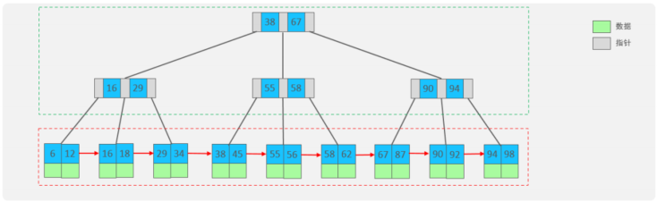
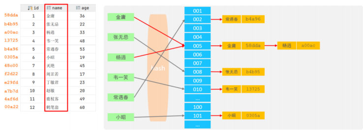

# Mysql进阶

# 存储引擎

## MySQL体系结构

## 存储引擎介绍

存储引擎就是存储数据、建立索引、更新/查询数据等技术的实现方式 。存储引擎是基于表的，而不是基于库的，所以存储引擎也可被称为表类型。我们可以在创建表的时候，来指定选择的存储引擎，如果没有指定将自动选择默认的存储引擎。

（1）建表时指定存储引擎

```sql
CREATE TABLE 表名(
字段1 字段1类型 [ COMMENT 字段1注释 ] ,
......
字段n 字段n类型 [COMMENT 字段n注释 ]
) ENGINE = INNODB [ COMMENT 表注释 ] ;
```

（2）查询当前数据库支持的存储引擎

```sql
show engines;
```


## 存储引擎特点

常见的存储引擎有**InnoDB、MyISAM、Memory**


## 存储引擎选择


# 索引

==很重要==

## 概述

索引（index）是帮助MySQL高效获取数据的数据结构(有序)。在数据之外，数据库系统还维护着满足特定查找算法的数据结构，这些数据结构以某种方式引用（**指向**）数据， 这样就可以在这些数据结构上实现高级查找算法，这种数据结构就是索引。

| 优势                                                         | 劣势                                                         |
| :----------------------------------------------------------- | :----------------------------------------------------------- |
| 提高数据检索的效率，降低数据库的 IO 成本                     | 索引列也是要占用空间的。                                     |
| 通过索引列对数据进行排序，降低数据排序的成本，降低 CPU 的消耗。 | 索引大大提高了查询效率，同时却也降低更新表的速度，如对表进行 INSERT、UPDATE、DELETE 时，效率降低。 |

**表结构：**



**执行语句**：`select * from user where age = 45;`

（1）无索引情况



没有索引的情况，需要第一行开始扫描，一直扫描到最后一行

（2）有索引情况



针对表中的`age`建立二叉树结构，这样查询次数减小到3次


## 索引结构

主要的索引结构包含以下几种：

| **索引结构**             | **描述**                                                     |
| ------------------------ | ------------------------------------------------------------ |
| **B+Tree索引**           | 最常见的索引类型，大部分引擎都支持 B+ 树索引                 |
| **Hash索引**             | 底层数据结构是用哈希表实现的，只有精确匹配索引列的查询才有效，不支持范围查询 |
| **R-tree (空间索引)**    | 空间索引是 MyISAM 引擎的一个特殊索引类型，主要用于地理空间数据类型，通常使用较少 |
| **Full-text (全文索引)** | 是一种通过建立倒排索引，快速匹配文档的方式。类似于 Lucene, Solr, ES |

不同的存储引擎对于索引结构的支持情况：

| 索引            | InnoDB           | MyISAM | Memory |
| :-------------- | :--------------- | :----- | :----- |
| **B+tree索引**  | 支持             | 支持   | 支持   |
| **Hash 索引**   | 不支持           | 不支持 | 支持   |
| **R-tree 索引** | 不支持           | 支持   | 不支持 |
| **Full-text**   | 5.6 版本之后支持 | 支持   | 不支持 |


### B-Tree

B树是一种多叉路平衡查找树，相对于二叉树，B树每个节点可以有多个分叉



以5阶B树为例，每一个最多存储4个key，对应5个指针（4个key有5个邻居）

在存储的顺序中，一旦节点存储的key达到5个，就会裂变，中间元素向上

B树，非叶子节点和叶子节点都会存放数据

### B+Tree

B+Tree是B-Tree的变种



- 绿色框框起来的部分，是索引部分，仅仅起到索引数据的作用，不存储数据。
- 红色框框起来的部分，是数据存储部分，在其叶子节点中要存储具体的数据。

与B-Tree的相比，区别如下：

- 所有的数据都会出现在叶子节点
- 叶子节点形成一个单向列表
- 非叶子节点仅仅起到索引数据作用，具体的数据都是在叶子节点存放的。

### Hash

哈希索引就是采用一定的hash算法，将键值换算成新的hash值，映射到对应的槽位上，然后存储在hash表中。

如果两个(或多个)键值，映射到一个相同的槽位上，他们就产生了hash冲突，则生成链表



**特点**

-  Hash索引只能用于对等比较(=，in)，不支持范围查询
- 无法利用索引完成排序
- 查询效率高

## 